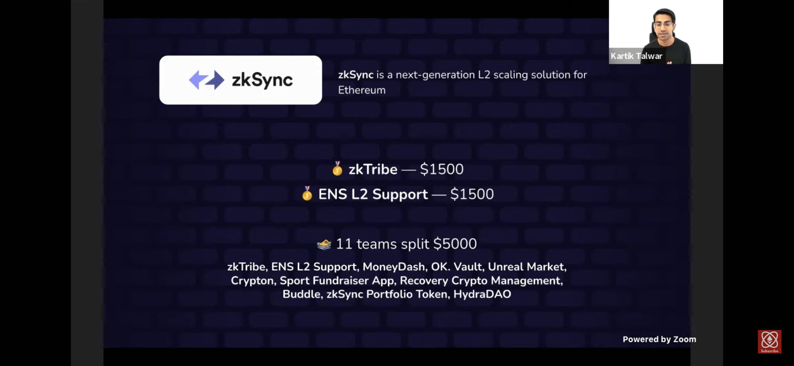

# ENS Layer2 Support - hackmoney2022

> 🥇 HackMoney 2020 - zkSync Best Application Prize
> 

## Description

This project implements ENS Layer2 Support outlined in [ENS Layer2 and offchain data support](https://docs.ens.domains/dapp-developer-guide/ens-l2-offchain) with [zkSync](https://zksync.io/).

While users can enjoy the benefits of their ENS names as usual on L1, they are now blessed with ~130x fewer gas fees and faster transaction speed. This project is also an example that can be replicated on other L2 chains to unlock further diversified scenarios.

## How it's made

This project follows https://eips.ethereum.org/EIPS/eip-3668 and implements (1) a L1 offchian resolver, (2) a public gateway, and (2) a L2 public resolver and registry. The contracts are written in Solidity, and deployed on Ethereum and zkSync with Hardhat. The gateway is written in node.js and deployed on GCP, it's using zksync-web3 for communication with zkSync contracts.

L1 contract is deployed on [Görli Testnet](https://goerli.net/). Gateway is hosted with GCP. L2 contracts are deployed on [zkSync v2.0](https://v2-docs.zksync.io/dev/testnet/metamask.html).

- L1 Offchain Resolver: 0xF9CF7Bf515DB6657A632d185ae9B8A1643004496
- Gateway: https://gateway.pps.onl
- L2 Public Resolver: 0x59dEFA8B25aC6DcD393507DE486C8E4835d945b3
- L2 Public Registry: 0x4C8feDB7F0EF9337DADEb55fFb41Da763f357f6e

## Usage

Any ENS second-level domain (e.g. pps.eth) owners can choose to migrate into the L2 Public Registry & Resolver by:

1. set resolver of the second-level domain to **L1 Offchain Resolver: 0xF9CF7Bf515DB6657A632d185ae9B8A1643004496**
2. use the `moveIn` method provided by the L2 Public Registry to setup ownership for ENS records update on L2

## Demo

For demo purpose, we've migrated `pps.eth` to `L1 Offchain Resolver`. We've also set a few ENS records with `L2 Public Resolver` for `3n4.pps.eth`. You can check the records live on: https://app.ens.domains/name/3n4.pps.eth/details

HackMoney Project page: https://web.archive.org/web/20220703203406/https://showcase.ethglobal.com/hackmoney2022/ens-l2-support-zksync-demo-zoqbi
